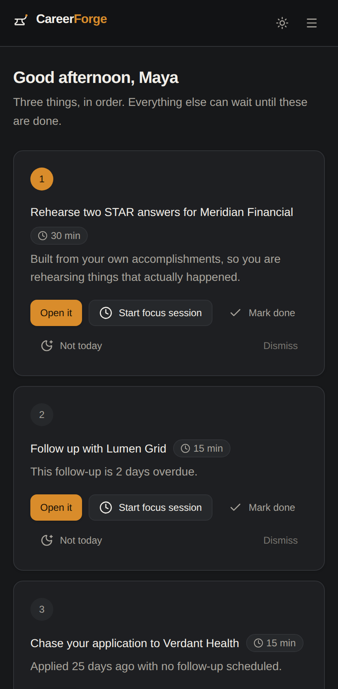

# CareerForge

A personal job-search operating system: capture opportunities, judge fit
honestly, tailor application materials from your real record, and know what to
do next.

Part of the [Dragon Phoenix Ascension](../README.md) ecosystem, and a
self-contained sub-app — nothing outside `careerforge/` depends on it, and it
depends on nothing outside itself.

---

## Contents

- [What it does](#what-it-does)
- [Screenshots](#screenshots)
- [Architecture](#architecture)
- [Local setup](#local-setup)
- [Environment variables](#environment-variables)
- [Database](#database)
- [Demo mode](#demo-mode)
- [Tests](#tests)
- [Deployment](#deployment)
- [Security and privacy](#security-and-privacy)
- [Roadmap](#roadmap)

---

## What it does

A job search collapses under its own admin long before it collapses for lack of
opportunities. CareerForge holds the whole thing — profile, pipeline, analysis,
drafts, follow-ups — and hands back **three concrete actions at a time**.

**Honest fit scoring.** Every job gets a 0–100 score with its reasoning shown.
Each skill the posting asks for is labelled by evidence:

| Label | Means |
|---|---|
| **Confirmed** | You listed it as a skill. Safe to claim. |
| **Inferred** | It appears in your history, or is implied by a related skill, but you did not claim it. Check you can defend it. |
| **No evidence** | Nothing in your profile supports it. Treat it as a gap. |

That distinction is the product. A score that quietly counts "probably fine" as
a match is worse than no score, because it sends you into an interview
defending a claim you cannot support.

**Materials from your real record.** Cover letters, outreach, resume bullets,
interview questions, and STAR prompts are assembled from your accomplishment
bank and nothing else. Each draft shows which accomplishments it drew on, so
you can audit it. No employer, date, metric, certification, or skill is ever
introduced that you did not enter.

**A pipeline you can see.** Kanban or table, search, filters, six sorts,
follow-up dates, and an activity trail that fills itself in as you work.

**Three things, then stop.** Today shows at most three actions, one per job,
each naming a company and a verb, each sized 5–60 minutes, each with a focus
timer. Everything else waits.

**Analytics that refuse to flatter.** Every rate carries the counts behind it
and is marked unreliable under eight applications, because six applications and
one reply is not a 17% response rate — it is one reply. The diagnosis names a
next action rather than describing a shape.

### Built for a particular kind of user

The primary user is a technically capable job seeker with ADHD. That shaped
concrete decisions, not just copy:

- **Three actions, hard-capped in the engine** — not a scrollable list the UI
  happens to truncate.
- **Autosave everywhere**, with an explicit save indicator. No save buttons to
  remember and no work lost to a closed tab.
- **Status changes through a menu, not drag-and-drop.** Dragging is pleasant
  with a mouse and hostile with a keyboard, a touchscreen, or a tremor — and
  this is the most-repeated action in the app.
- **Completion is subtle.** The focus timer counts down and stops. No streak,
  no score, no penalty for stopping early. The point is to make starting cheap,
  not to build a habit loop around the app.
- **Named checklist steps instead of a completion percentage.** "Add three
  accomplishments" is actionable; "62%" is only something to feel bad about.

---

## Screenshots

### Today — what to do next


### Fit analysis — with the evidence shown


### Pipeline


### Analytics


### Profile


### Mobile


Screenshots are captured from the seeded demo account by `capture.mjs`, so they
stay honest about what the app actually renders. Regenerate them with the app
running on port 3100:

```bash
node capture.mjs
```

---

## Architecture

```
careerforge/
├── prisma/
│   ├── schema.prisma          # 13 models, enums, indexes, cascade paths
│   ├── migrations/
│   └── seed.ts                # the fictional demo account
├── e2e/                       # Playwright: workflow, auth, responsive, a11y
└── src/
    ├── app/
    │   ├── (auth)/            # sign-in, sign-up
    │   ├── (app)/             # today, jobs, profile, analytics — all guarded
    │   ├── api/               # auth handler, material export
    │   └── page.tsx           # public landing
    ├── components/
    │   ├── ui/                # shadcn-style primitives, vendored
    │   ├── forms/             # Field, EntityDialog, SubmitButton
    │   ├── jobs/              # badges shared across views
    │   └── layout/            # nav, page shell, user menu
    └── lib/
        ├── ai/                # provider abstraction, heuristics, templates
        ├── domain/            # pure logic: focus, analytics, filters, export
        ├── server/            # prisma, env, session, rate limit, actions
        └── validation/        # Zod schemas for every input
```

### The pieces that carry weight

**`src/lib/server/session.ts` — one authorization choke point.** Every server
action and route handler starts here. Nothing below it accepts a user id from
the client: ownership is always derived from the session, and child records are
reached through a `where` clause naming the owning user. A forged id in a
request body finds nothing rather than someone else's data. Cross-user access
returns 404, not 403, so the response leaks nothing either.

**`src/lib/ai/` — a swappable provider behind one interface.** `AiProvider` has
two implementations:

- **`MockAiProvider`** — the default. Not a stub: it runs real heuristics and
  real templates over the candidate's own record, so scoring, drafts,
  recommendations, and analytics all work with no API key, no network, and no
  spend. Local development, CI, and the demo account behave identically, and a
  vendor outage degrades CareerForge rather than breaking it.
- **`AnthropicProvider`** — real Claude calls when `AI_PROVIDER=anthropic`.

Both are validated by the same Zod schemas, so a model that drifts, hallucinates
a field, or returns prose fails at the boundary instead of reaching the
database. Adding a vendor means writing one class and adding a branch in
`src/lib/ai/index.ts`.

**`src/lib/server/ai-context.ts` — the only place facts reach a provider.**
Nothing is sent except what this file selects, which is what makes "generated
material cannot invent an employer" checkable rather than aspirational. It also
computes the analysis input hash: a stored analysis is reused whenever the
posting, the profile, and the provider are unchanged, so revisiting a job costs
nothing and you pay for a model call only when something actually changed or you
ask for one.

**`src/lib/domain/` — pure functions, no I/O.** Focus recommendations, analytics
and its diagnosis, filtering and sorting, and export formatting are all pure,
which is why they carry the bulk of the unit tests and produce the same answer
for the same state.

### Data model

Thirteen models: `User`, `CandidateProfile`, `Employment`, `Education`, `Skill`,
`Accomplishment`, `Resume`, `JobOpportunity`, `JobAnalysis`,
`ApplicationMaterial`, `Activity`, `FollowUp`, `FocusTask`.

Every child record reaches a user through a cascade path, which is what lets
authorization be a single ownership check at the aggregate root rather than a
check repeated per table. Notable constraints:

- `Skill` is unique on `(profileId, normalizedName)`, so "Go" and "go" cannot
  become two skills that score separately.
- `ApplicationMaterial` is unique on `(jobId, kind)` — one draft per kind per
  job, with the untouched generator output kept alongside your edits so
  "revert to generated" is possible.
- `FocusTask` is unique on `(userId, recipeKey)`. The key is what makes
  completing or snoozing a recommendation stick across regenerations.
- `JobAnalysis.inputHash` is indexed and drives the analysis cache.

### Stack

Next.js 16 (App Router) · TypeScript strict · Tailwind CSS v4 · shadcn-style
components vendored into the repo · PostgreSQL · Prisma · Auth.js v5 · Zod ·
Recharts · Vitest · Playwright.

---

## Local setup

**Prerequisites:** Node 20+ and a PostgreSQL 14+ server.

```bash
cd careerforge
npm install

cp .env.example .env.local          # then edit DATABASE_URL and AUTH_SECRET
openssl rand -base64 32             # a value for AUTH_SECRET

npm run db:migrate                  # create the schema
npm run db:seed                     # load the demo account

npm run dev                         # http://localhost:3000
```

Sign in with **Explore the demo account**, or create your own.

---

## Environment variables

`.env.example` is the full list with placeholder values. It is committed;
`.env*` is otherwise gitignored.

| Variable | Required | Purpose |
|---|---|---|
| `DATABASE_URL` | yes | PostgreSQL connection string |
| `AUTH_SECRET` | yes | Session signing secret, ≥16 chars (`openssl rand -base64 32`) |
| `AUTH_URL` | in production | Canonical origin. Auth.js builds callback URLs from it — if it names the wrong origin, sign-in redirects off-site |
| `AI_PROVIDER` | no | `mock` (default) or `anthropic` |
| `ANTHROPIC_API_KEY` | if `anthropic` | Read server-side only |
| `ANTHROPIC_MODEL` | no | Defaults to `claude-sonnet-5` |
| `AI_RATE_LIMIT_MAX` | no | AI calls per window per user (default 20) |
| `AI_RATE_LIMIT_WINDOW_MS` | no | Window length (default 1 hour) |
| `NEXT_PUBLIC_DEMO_MODE` | no | Shows the one-click demo login. Turn off in any deployment holding real data |
| `DEMO_EMAIL` / `DEMO_PASSWORD` | no | Credentials the seed creates |

The environment is parsed by Zod at boot (`src/lib/server/env.ts`), so a
misconfiguration fails loudly at startup rather than mysteriously at request
time. Selecting `anthropic` without a key is rejected there rather than
surfacing later as an opaque 401.

---

## Database

```bash
npm run db:migrate     # create and apply a migration in development
npm run db:deploy      # apply existing migrations (production)
npm run db:seed        # load the demo account
npm run db:reset       # drop, recreate, re-seed — destructive
npm run db:studio      # browse the data
```

---

## Demo mode

`npm run db:seed` creates one account built entirely from fictional data. "Maya
Okonkwo" is not a real person, the employers do not exist, and the metrics are
illustrative. The point is that every screen is understandable immediately
without exposing anyone's real career history.

It contains a full profile, seven opportunities across six pipeline stages, six
stored analyses, drafted materials for two jobs, an overdue follow-up, and one
deliberately unanalysed job so the empty state and the focus task that offers to
fix it are both visible.

Re-running the seed replaces the demo account's data and leaves every other
account untouched.

---

## Tests

```bash
npm run typecheck      # tsc --noEmit
npm run lint           # eslint, zero warnings tolerated
npm run format         # prettier --write
npm test               # Vitest — 150 unit tests
npm run test:e2e       # Playwright — 24 tests across desktop and mobile
```

**Unit tests** cover the parts where being wrong is expensive: the scoring
heuristics and their evidence classification, the focus recommendation engine's
constraints, analytics rates and the small-sample rule, filtering and sorting,
export formatting, and every validation schema.

**End-to-end tests** cover four areas:

- `workflow.spec.ts` — the whole primary path in one test: sign up, build a
  profile, add skills and an accomplishment, paste a posting, analyse it,
  generate a cover letter, confirm the draft names its sources, edit it and see
  it autosave and survive a reload, export the pack, advance the pipeline,
  check the activity trail, complete a focus task, and read the analytics.
- `auth.spec.ts` — protected routes, sign-out, the deliberately vague messages
  that avoid confirming which emails hold accounts, and a two-context test that
  one user cannot open or export another user's opportunity.
- `responsive.spec.ts` — runs on desktop and on a phone viewport, asserting no
  page scrolls horizontally.
- `accessibility.spec.ts` — keyboard submission, one `h1` per page, accessible
  names on every visible control, real table semantics, announced form errors.

The e2e suite builds and starts its own production server on port 3100 and
never reuses a running one, so it cannot silently test a stale build. It fails
fast with a readable message if the database is unreachable. It always runs
against the mock provider, so it costs nothing and needs no network.

---

## Deployment

Any Node host that can reach a PostgreSQL database.

```bash
npm ci
npm run db:deploy
npm run build
npm start
```

Set at minimum `DATABASE_URL`, `AUTH_SECRET`, and `AUTH_URL`. Set
`NEXT_PUBLIC_DEMO_MODE=false` for any deployment holding real data.

**On Vercel:** this sub-app is not wired into the root project's deployment. To
deploy it, create a separate Vercel project with the root directory set to
`careerforge/`, add the environment variables, and set the build command to
`prisma generate && next build` (already the `build` script). Run
`npm run db:deploy` against the production database as a release step.

Note the in-memory rate limiter under [Security](#security-and-privacy) if you
plan to run more than one instance.

---

## Security and privacy

- **Authorization on every server operation.** One choke point
  (`src/lib/server/session.ts`); no operation accepts a user id from the client.
  Cross-user access returns 404, so the response reveals nothing about what
  exists.
- **Passwords** are bcrypt at cost 12. Sign-in runs a comparison against a dummy
  hash when the email is unknown, so timing cannot be used to enumerate
  accounts, and both failure modes return the same message.
- **Secrets stay server-side.** Every module touching `process.env` imports
  `server-only`, so importing one from a client component is a build error.
- **Resumes and generated material are never logged.** Errors are logged by
  name and digest only; provider failures never surface their body, which can
  echo the prompt.
- **Every input is validated with Zod** before it reaches the database, with
  length caps and control-character stripping on free text. Posting URLs are
  scheme-checked at the boundary, so `javascript:` and `data:` are rejected once
  rather than sanitised at each render site.
- **Rate limiting** on both AI endpoints, per user. A cached analysis is served
  without consuming the budget, since it costs nothing.
- **Security headers** — `nosniff`, `DENY` framing, a restrictive
  `Permissions-Policy`, and a strict referrer policy. Exports are served as
  attachments with `no-store`.
- **`.env*` is gitignored** apart from `.env.example`, which holds placeholders
  only.

**Known limitations, stated rather than buried:**

- The rate limiter is in-memory, so behind multiple instances it becomes
  per-instance. It protects your own API bill and a runaway client loop, not a
  distributed attacker. The seam is the `hits` map in
  `src/lib/server/rate-limit.ts`; swap it for Redis when you scale out.
- There is no email verification and no password reset. Both need a mail
  provider, which is a deployment decision rather than a code one.
- Generated material is a first draft. Nothing is invented, but the wording is
  yours to own — read it before you send it.

---

## Roadmap

Deliberately not built yet, in rough priority order:

1. **Password reset and email verification** — needs a mail provider.
2. **Resume file import** — parse an uploaded PDF or DOCX into the profile
   instead of pasting text.
3. **Per-material regeneration with a prompt** — "make this shorter", "lead with
   the ledger work", rather than an all-or-nothing regenerate.
4. **Interview outcome tracking** — record what was actually asked, so the
   question generator learns from your real loops instead of from the posting.
5. **Redis-backed rate limiting and sessions** — the prerequisite for running
   more than one instance.
6. **Calendar integration** for interview scheduling and follow-up reminders.
7. **Weekly digest email** — the Today list, delivered, for the days the app
   does not get opened.

Explicitly out of scope: auto-applying to jobs, scraping job boards, and
anything that submits an application without the user reading it first. The
product's value depends on the user staying the author.
